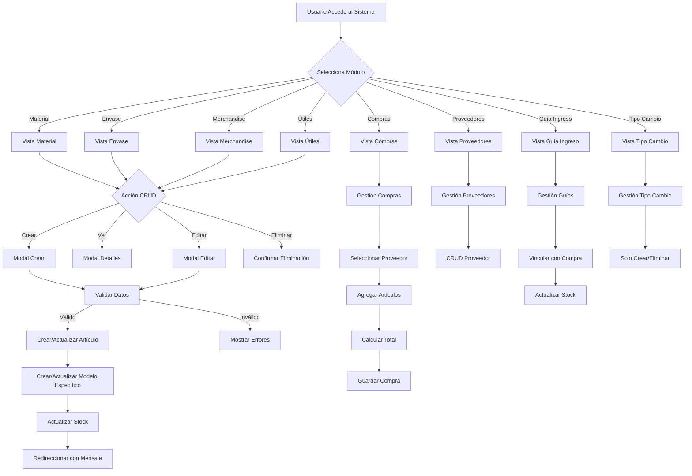
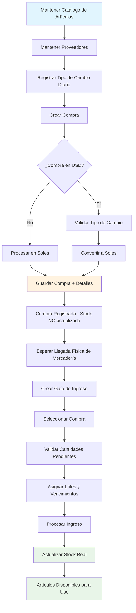

# Análisis de Vistas de Artículos - Sistema Pedidos GROBDI

## Resumen Ejecutivo

Este documento presenta un análisis detallado de las vistas relacionadas con los diferentes tipos de artículos en el sistema: Insumos, Material, Envases, Merchandise, Útiles, Compras, Proveedores, Guía de Ingreso y Tipo de Cambio.

## Estructura General del Sistema

### Modelo Central: Artículo
El sistema utiliza un modelo central `Articulo` con discriminador de tipo que permite manejar diferentes categorías:

**Tipos de Artículos:**
- `insumo` - Insumos para producción
- `material` - Materiales de empaque
- `envase` - Envases de productos
- `merchandise` - Mercancías/productos terminados
- `util` - Útiles de oficina/diversos
- `base` - Bases de productos
- `prebase` - Pre-bases
- `producto_final` - Productos finales

### Esquema de Base de Datos

```sql
-- Tabla principal de artículos
articulos (
    id, sku, nombre, descripcion, stock, estado, 
    tipo ENUM('insumo', 'material', 'envase', 'merchandise', 'util', 'base', 'prebase', 'producto_final'),
    created_by, updated_by, timestamps
)

-- Tablas especializadas
insumos (id, articulo_id, precio, unidad_de_medida_id, es_caro)
empaques (id, articulo_id, tipo ENUM('material', 'envase'), precio)
merchandises (id, articulo_id, precio)
utiles (id, articulo_id, precio)
```

## Análisis Detallado por Vista

### 1. MATERIAL (`/cotizador/administracion/material/`)

**Estructura de Datos:**
- **Modelo:** `Empaque` con `tipo = 'material'`
- **Relación:** `Empaque -> Articulo`
- **Campos:** nombre, precio, stock, unidad de medida (fija: "und")

**Campos del Formulario:**
```php
- nombre (string, required, unique en articulos)
- precio (numeric, required, min:0, step:0.0001)
- unidad_de_medida (readonly: "und")
```

**Funcionalidades:**
- ✅ Listado con filtros activo/inactivo
- ✅ Crear nuevo material (modal)
- ✅ Ver detalles (modal)
- ✅ Editar (modal)
- ✅ Eliminar (soft delete - marca como inactivo)
- ✅ DataTables con búsqueda
- ✅ Mostrar último precio de compra

### 2. ENVASES (`/cotizador/administracion/envases/`)

**Estructura de Datos:**
- **Modelo:** `Empaque` con `tipo = 'envase'`
- **Relación:** `Empaque -> Articulo`
- **Campos:** nombre, precio, stock

**Campos del Formulario:**
```php
- nombre (string, required, unique)
- precio (numeric, required, min:0, step:0.0001)
```

**Funcionalidades:**
- ✅ Listado con filtros activo/inactivo
- ✅ Crear nuevo envase (modal)
- ✅ Ver detalles (modal)
- ✅ Editar (modal)
- ✅ Eliminar (soft delete)
- ✅ DataTables con búsqueda
- ✅ Mostrar último precio de compra

### 3. MERCHANDISE (`/cotizador/merchandise/`)

**Estructura de Datos:**
- **Modelo:** `Merchandise`
- **Relación:** `Merchandise -> Articulo`
- **Campos:** nombre, precio, stock

**Campos del Formulario:**
```php
- nombre (string, required, unique)
- precio (numeric, required, min:0)
```

**Funcionalidades:**
- ✅ Listado con filtros activo/inactivo
- ✅ Crear nuevo merchandise (modal)
- ✅ Ver detalles (modal)
- ✅ Editar (modal)
- ✅ Eliminar (soft delete)
- ✅ DataTables con búsqueda
- ✅ Mostrar último precio de compra

### 4. ÚTILES (`/cotizador/util/`)

**Estructura de Datos:**
- **Modelo:** `Util`
- **Relación:** `Util -> Articulo`
- **Campos:** nombre, precio, stock

**Campos del Formulario:**
```php
- nombre (string, required, unique)
- precio (numeric, required, min:0)
```

**Funcionalidades:**
- ✅ Listado con filtros activo/inactivo
- ✅ Crear nuevo útil (modal)
- ✅ Ver detalles (modal)
- ✅ Editar (modal)
- ✅ Eliminar (soft delete)
- ✅ DataTables con búsqueda
- ✅ Mostrar último precio de compra

### 5. COMPRAS (`/compras/`)

**Estructura de Datos:**
- **Modelo:** `Compra`
- **Relaciones:** `Compra -> Proveedor`, `Compra -> DetalleCompra -> Articulo`
- **Campos:** serie, numero, fecha_emision, precio_total, proveedor_id, moneda_id

**Campos del Formulario:**
```php
- proveedor_id (select, required)
- fecha_emision (date, required)
- serie (string, required)
- numero (string, required)
- precio_total (calculated)
- condicion_pago (string)
- moneda_id (select)
- igv (numeric)
```

**Funcionalidades:**
- ✅ Listado con filtros por proveedor y fechas
- ✅ Crear nueva compra
- ✅ Ver detalles (modal)
- ✅ Filtros avanzados (proveedor, rango de fechas)
- ✅ DataTables con búsqueda
- ✅ Selección de artículos por tipo

### 6. PROVEEDORES (`/proveedores/`)

**Estructura de Datos:**
- **Modelo:** `Proveedor`
- **Campos:** razon_social, ruc, telefono_1, correo_cpe, estado

**Campos del Formulario:**
```php
- razon_social (string, required)
- ruc (string, required, unique)
- telefono_1 (string)
- correo_cpe (email)
- estado (enum: activo/inactivo)
```

**Funcionalidades:**
- ✅ Listado con filtros activo/inactivo
- ✅ Crear nuevo proveedor
- ✅ Ver detalles (modal)
- ✅ Editar proveedor
- ✅ Eliminar (soft delete)
- ✅ DataTables con búsqueda

### 7. GUÍA DE INGRESO (`/guia_ingreso/`)

**Estructura de Datos:**
- **Modelo:** `GuiaIngreso`
- **Relaciones:** `GuiaIngreso -> Compra -> Proveedor`, `GuiaIngreso -> DetalleGuiaIngreso`
- **Campos:** nombre, fecha, compra_id

**Campos del Formulario:**
```php
- nombre (string, required)
- fecha (date, required)
- compra_id (select, required)
```

**Funcionalidades:**
- ✅ Listado de guías
- ✅ Crear nueva guía
- ✅ Ver detalles (modal)
- ✅ Eliminar con reversión de stock
- ✅ DataTables con búsqueda
- ⚠️ **No tiene funcionalidad de edición**

### 8. TIPO DE CAMBIO (`/tipo_cambio/`)

**Estructura de Datos:**
- **Modelo:** `TipoCambio`
- **Relaciones:** `TipoCambio -> TipoMoneda`
- **Campos:** valor_compra, valor_venta, fecha, tipo_moneda_id

**Campos del Formulario:**
```php
- tipo_moneda_id (select, required)
- valor_compra (numeric, required, step:0.0001)
- valor_venta (numeric, required, step:0.0001)
- fecha (date, required)
```

**Funcionalidades:**
- ✅ Listado de tipos de cambio
- ✅ Crear nuevo tipo de cambio
- ✅ Eliminar (solo del día actual)
- ✅ DataTables con búsqueda
- ⚠️ **No tiene funcionalidad de edición**
- ⚠️ **No tiene vista de detalles**

## Análisis de Redundancias

### 1. **Redundancia en Estructura de Vistas**

**Problema Identificado:**
Las vistas de Material, Envases, Merchandise y Útiles tienen estructuras prácticamente idénticas:

```blade
<!-- Patrón repetido en las 4 vistas -->
- Mismo header con título dinámico
- Mismos botones de filtro activo/inactivo
- Misma tabla con columnas similares
- Mismos modales para CRUD
- Mismo JavaScript para DataTables
```

**Impacto:**
- **Mantenimiento:** Cambios requieren actualización en 4 archivos
- **Consistencia:** Riesgo de inconsistencias entre vistas similares
- **Código duplicado:** ~80% del código es repetitivo

### 2. **Redundancia en Controladores**

**Problema Identificado:**
Los controladores Material, Envase, Merchandise y Util tienen lógica muy similar:

```php
// Patrón repetido en los 4 controladores
public function index() {
    $estado = request()->estado;
    // Lógica similar de filtrado por estado
}

public function store(Request $request) {
    // Validaciones similares
    // Creación de Articulo + modelo específico
}
```

### 3. **Redundancia en Modelos**

**Problema Identificado:**
Los modelos Empaque, Merchandise y Util tienen relaciones y métodos similares:

```php
// Patrón repetido
public function articulo() {
    return $this->belongsTo(Articulo::class);
}

public function ultimoLote() {
    return $this->hasOne(Lote::class, 'articulo_id', 'articulo_id')->latestOfMany();
}
```

## Análisis de Datos Faltantes

### 1. **Campos Inconsistentes**

| Campo | Material | Envase | Merchandise | Útiles | Insumo |
|-------|----------|--------|-------------|--------|--------|
| Unidad de Medida | ✅ (fijo) | ❌ | ❌ | ❌ | ✅ |
| Descripción | ❌ | ❌ | ❌ | ❌ | ✅ |
| Es Caro | ❌ | ❌ | ❌ | ❌ | ✅ |
| Stock Mínimo | ❌ | ❌ | ❌ | ❌ | ❌ |
| Stock Máximo | ❌ | ❌ | ❌ | ❌ | ❌ |

### 2. **Funcionalidades Faltantes**

**Guía de Ingreso:**
- ❌ No tiene funcionalidad de edición
- ❌ No se puede modificar después de crear
- ❌ No hay historial de cambios

**Tipo de Cambio:**
- ❌ No tiene funcionalidad de edición
- ❌ No hay vista de detalles
- ❌ Solo se puede eliminar del día actual

### 3. **Validaciones Inconsistentes**

```php
// Material: validación completa
'nombre' => 'required|string|max:255|unique:articulos,nombre,'

// Algunos formularios no validan unicidad
// Algunos no tienen validación de longitud máxima
```

## Diagrama de Flujo del Sistema



## Recomendaciones de Mejora

### 1. **Consolidación de Vistas**

**Crear una vista genérica reutilizable:**
```blade
<!-- resources/views/articulos/generic-crud.blade.php -->
@extends('adminlte::page')
@section('content')
    @include('articulos.partials.header', ['tipo' => $tipo])
    @include('articulos.partials.filters', ['tipo' => $tipo])
    @include('articulos.partials.table', ['items' => $items, 'tipo' => $tipo])
    @include('articulos.partials.modals', ['tipo' => $tipo])
@endsection
```

### 2. **Controlador Genérico**

**Crear un controlador base:**
```php
abstract class BaseArticuloController extends Controller
{
    protected $modelo;
    protected $tipo;
    protected $vista;
    
    public function index() {
        // Lógica común para todos los tipos
    }
    
    public function store(Request $request) {
        // Lógica común de creación
    }
}

class MaterialController extends BaseArticuloController
{
    protected $modelo = Empaque::class;
    protected $tipo = 'material';
    protected $vista = 'material';
}
```

### 3. **Estandarización de Campos**

**Agregar campos faltantes:**
- Descripción a todos los tipos
- Unidad de medida consistente
- Stock mínimo/máximo
- Categoría/subcategoría

### 4. **Mejoras en Funcionalidad**

**Guía de Ingreso:**
- Agregar funcionalidad de edición
- Permitir modificación de cantidades
- Historial de cambios

**Tipo de Cambio:**
- Agregar vista de detalles
- Permitir edición con validaciones
- Historial de cambios por fecha

### 5. **Optimizaciones de Base de Datos**

**Índices recomendados:**
```sql
CREATE INDEX idx_articulos_tipo_estado ON articulos(tipo, estado);
CREATE INDEX idx_empaques_tipo ON empaques(tipo);
CREATE INDEX idx_compras_fecha_proveedor ON compras(fecha_emision, proveedor_id);
```

## Conclusiones

### Fortalezas del Sistema Actual
1. ✅ **Arquitectura sólida** con modelo central Articulo
2. ✅ **Funcionalidades CRUD completas** en la mayoría de módulos
3. ✅ **Filtros y búsquedas** implementados
4. ✅ **Soft deletes** para preservar historial
5. ✅ **Validaciones básicas** implementadas

### Áreas de Mejora Prioritarias
1. 🔴 **Alta redundancia** en vistas y controladores
2. 🔴 **Inconsistencia** en campos y validaciones
3. 🟡 **Funcionalidades incompletas** en Guía de Ingreso y Tipo de Cambio
4. 🟡 **Falta de estandarización** en formularios

### Impacto del Refactoring Propuesto
- **Reducción del código duplicado** en ~70%
- **Mejor mantenibilidad** y consistencia
- **Funcionalidades más completas** en todos los módulos
- **Mayor flexibilidad** para agregar nuevos tipos de artículos

El sistema tiene una base sólida pero se beneficiaría significativamente de un refactoring que elimine redundancias y estandarice la funcionalidad entre todos los tipos de artículos.

---

## ANÁLISIS DETALLADO DEL MÓDULO DE COMPRAS Y SUS COMPLEMENTOS

### Módulo de Compras - Flujo Principal

El módulo de Compras es el núcleo del sistema de gestión de inventarios y actúa como el punto de entrada para todos los artículos al sistema.

#### 1. COMPRAS (`/compras/`)

**Propósito Principal:**
- Registro de facturas de proveedores
- Control de adquisiciones de todos los tipos de artículos
- Gestión de costos y conversión de monedas
- Base para el control de stock

**Estructura de Datos Completa:**
```php
// Tabla: compras
- id, serie, numero, precio_total, proveedor_id, fecha_emision
- condicion_pago, moneda_id, igv, created_by, timestamps

// Tabla: detalle_compra  
- id, compra_id, articulo_id, cantidad, precio
```

**Campos del Formulario de Compra:**
```php
// Datos de la factura
- serie (string, required) - Ej: "F001"
- numero (number, required) - Ej: "000001"
- condicion_pago (enum: Contado/Crédito, required)

// Proveedor y moneda
- proveedor_id (select, required)
- moneda_id (select: PEN/USD, required) 
- fecha_emision (date, required, max: today)

// Configuración fiscal
- igv (boolean: Agregar IGV / El precio incluye IGV)

// Artículos (dinámico)
- articulos[] (array de IDs de artículos)
- cantidades[] (array de quantities)
- precios[] (array de precios unitarios)
```

**Funcionalidades Específicas:**

1. **Selección de Artículos por Tipo:**
   - Filtro por tipo: insumo, material, envase, merchandise, util
   - Búsqueda por nombre de artículo
   - Excluye: base, prebase, producto_final (solo para producción interna)

2. **Cálculo Automático de Totales:**
   - Subtotal = Σ(cantidad × precio_unitario)
   - IGV = subtotal × 0.18 (si aplica)
   - Total = subtotal + IGV

3. **Conversión de Monedas:**
   - Si es USD: busca tipo de cambio vigente
   - Convierte a soles usando valor_venta del tipo de cambio
   - Valida existencia de tipo de cambio para fechas anteriores

4. **Validaciones Importantes:**
   - No permite duplicar serie+numero+proveedor
   - Requiere tipo de cambio si es compra en USD
   - Fecha no puede ser futura

#### 2. PROVEEDORES (`/proveedores/`) - Mantenimiento Complementario

**Estructura de Datos:**
```php
// Tabla: proveedores
- id, razon_social, ruc, telefono_1, correo_cpe, estado, timestamps
```

**Campos del Formulario:**
```php
- razon_social (string, required)
- ruc (string, required, unique)
- telefono_1 (string, optional)
- correo_cpe (email, optional)
- estado (enum: activo/inactivo, default: activo)
```

**Funcionalidades:**
- ✅ CRUD completo
- ✅ Filtros activo/inactivo
- ✅ Soft delete
- ✅ Integración con compras

**Relación con Compras:**
- Una compra DEBE tener un proveedor
- Se muestran solo proveedores activos en el selector de compras

#### 3. TIPO DE CAMBIO (`/tipo_cambio/`) - Mantenimiento Complementario Crítico

**Estructura de Datos:**
```php
// Tabla: tipo_moneda
- id, nombre, codigo_iso, simbolo

// Tabla: tipo_cambio  
- id, tipo_moneda_id, valor_compra, valor_venta, fecha
```

**Campos del Formulario:**
```php
- tipo_moneda_id (fixed: 1 = USD)
- valor_compra (decimal, required, step: 0.0001)
- valor_venta (decimal, required, step: 0.0001)
- fecha (auto: date('Y-m-d'))
```

**Funcionalidades Específicas:**
- ✅ Solo registra cambios para USD (hardcoded)
- ✅ Un registro por día
- ✅ Solo permite eliminar registros del día actual
- ⚠️ **No tiene edición** - debe eliminar y recrear
- ⚠️ **No tiene vista de detalles**

**Flujo de Uso:**
1. **Vista Resumen** (`/resumen-tipo-cambio`): Vista principal
2. **Vista Historial** (`/tipo_cambio`): Historial de cambios
3. **Crear**: Modal desde vista resumen

**Impacto en Compras:**
- Compras en USD requieren tipo de cambio vigente
- Sistema busca el último tipo de cambio <= fecha_emision
- Si no existe, bloquea la compra en USD

#### 4. GUÍA DE INGRESO (`/guia_ingreso/`) - Proceso Post-Compra

**Propósito:**
- Registro físico de mercadería que llega al almacén
- Control de lotes y fechas de vencimiento  
- Actualización real del stock de artículos
- Trazabilidad de ingresos parciales

**Estructura de Datos:**
```php
// Tabla: guia_ingreso
- id, nombre, fecha, compra_id, timestamps

// Tabla: detalle_guia_ingreso
- id, guia_ingreso_id, lote_id, fecha_vencimiento, cantidad, detalle_compra_id

// Tabla: lotes
- id, articulo_id, num_lote, fecha_vencimiento, precio
```

**Campos del Formulario:**
```php
- nombre (string, required) - Nombre descriptivo de la guía
- fecha (date, required)
- compra_id (select, required) - Factura asociada

// Por cada artículo de la compra:
- cantidad (integer, min: 1, max: pendiente)
- lote (string, max: 50) - Manual o seleccionar existente
- fecha_vencimiento (date, required)
```

**Funcionalidades Avanzadas:**

1. **Control de Cantidades Pendientes:**
   - Calcula automáticamente cantidad pendiente por producto
   - No permite ingresar más de lo pendiente
   - Permite ingresos parciales en múltiples guías

2. **Gestión de Lotes:**
   - Crear lote nuevo (manual)
   - Seleccionar lote existente (dropdown con fechas)
   - Auto-completar fecha de vencimiento si usa lote existente

3. **Actualización de Stock:**
   - Solo actualiza stock cuando se crea la guía de ingreso
   - La compra NO actualiza stock directamente
   - Permite revertir stock al eliminar guía

4. **Trazabilidad:**
   - Rastrea qué cantidad de cada detalle de compra se ha ingresado
   - Historial de todas las guías por compra
   - Control de fechas de vencimiento por lote

**Flujo de Proceso:**
```
Compra → Guía de Ingreso → Actualización de Stock
   ↓           ↓                    ↓
Factura → Recepción física → Stock disponible
```

**Validaciones Importantes:**
- Solo compras con productos pendientes aparecen en selector
- No permite cantidad > pendiente
- Requiere lote y fecha de vencimiento
- Al eliminar: revierte el stock automáticamente

### Mantenimientos de Artículos - Como Complemento de Compras

Los mantenimientos de artículos (Material, Envases, Merchandise, Útiles, Insumos) funcionan como **catálogos base** para el proceso de compras:

#### Relación con el Flujo de Compras:

1. **Pre-Compra:** Los artículos deben existir en el catálogo
2. **Durante Compra:** Se seleccionan del catálogo por tipo
3. **Post-Compra:** Se actualizan via Guía de Ingreso

#### Campos Relevantes para Compras:

```php
// Datos para selección en compras
- sku (único por artículo)
- nombre (búsqueda)
- tipo (filtro en modal de compras)
- stock (información actual)
- estado (solo activos aparecen en compras)

// Datos para referencia
- precio (precio de venta/producción, NO precio de compra)
- unidad_de_medida (para insumos)
```

**Importante:** El precio en los mantenimientos de artículos es el **precio de venta/producción**, NO el precio de compra. El precio de compra se registra en cada detalle de compra.

### Diagrama de Flujo Completo del Sistema de Compras



### Análisis de Redundancias en el Módulo de Compras

#### Fortalezas del Diseño Actual:

1. **Separación Clara de Responsabilidades:**
   - Compras = Registro contable/administrativo
   - Guía Ingreso = Control físico de inventario
   - Mantenimientos = Catálogos base

2. **Control de Trazabilidad:**
   - Desde factura hasta stock final
   - Control de lotes y vencimientos
   - Reversión posible de movimientos

3. **Flexibilidad Monetaria:**
   - Soporte multi-moneda
   - Conversión automática con tipos de cambio históricos

#### Áreas de Mejora Identificadas:

1. **Tipo de Cambio:**
   - ❌ No permite edición (solo eliminar y recrear)
   - ❌ Limitado solo a USD
   - ❌ No hay vista de detalles
   - ❌ Un solo registro por día (no permite correcciones)

2. **Guía de Ingreso:**
   - ❌ No permite editar después de crear
   - ❌ No hay historial de modificaciones
   - ❌ Interface compleja para lotes

3. **Compras:**
   - ⚠️ No permite editar después de crear
   - ⚠️ No hay reversa de compras (solo eliminar completa)
   - ⚠️ Validación de duplicados solo por proveedor

### Recomendaciones Específicas para Compras

#### 1. Mejoras en Tipo de Cambio:
```php
// Permitir múltiples registros por día con timestamp
- fecha_hora (datetime en lugar de date)
- motivo (string) - Razón del cambio
- activo (boolean) - Solo uno activo por día
```

#### 2. Mejoras en Guía de Ingreso:
```php
// Permitir ediciones controladas
- estado (enum: borrador, procesado, anulado)
- observaciones (text)
- editado_por, editado_en (audit trail)
```

#### 3. Ampliación de Compras:
```php
// Estados de compra
- estado (enum: registrada, parcial, completa, anulada)
- observaciones (text)
- archivo_adjunto (string) - Para subir factura PDF
```

### Conclusiones del Análisis de Compras

#### Fortalezas del Sistema:
1. ✅ **Flujo lógico bien estructurado** 
2. ✅ **Control de inventario robusto**
3. ✅ **Trazabilidad completa**
4. ✅ **Soporte multi-moneda**
5. ✅ **Validaciones de negocio apropiadas**

#### Prioridades de Mejora:
1. 🔴 **Flexibilidad en Tipo de Cambio** (permitir ediciones y múltiples registros)
2. 🔴 **Edición de Guías de Ingreso** (con control de estados)
3. 🟡 **Estados de Compra** (seguimiento de completitud)
4. 🟡 **Mejora de UX** en selección de lotes
5. 🟡 **Reportes de pendientes** por compra

El módulo de Compras es el más crítico del sistema y está bien diseñado arquitectónicamente, pero necesita mayor flexibilidad operativa para manejar casos reales de negocio.
