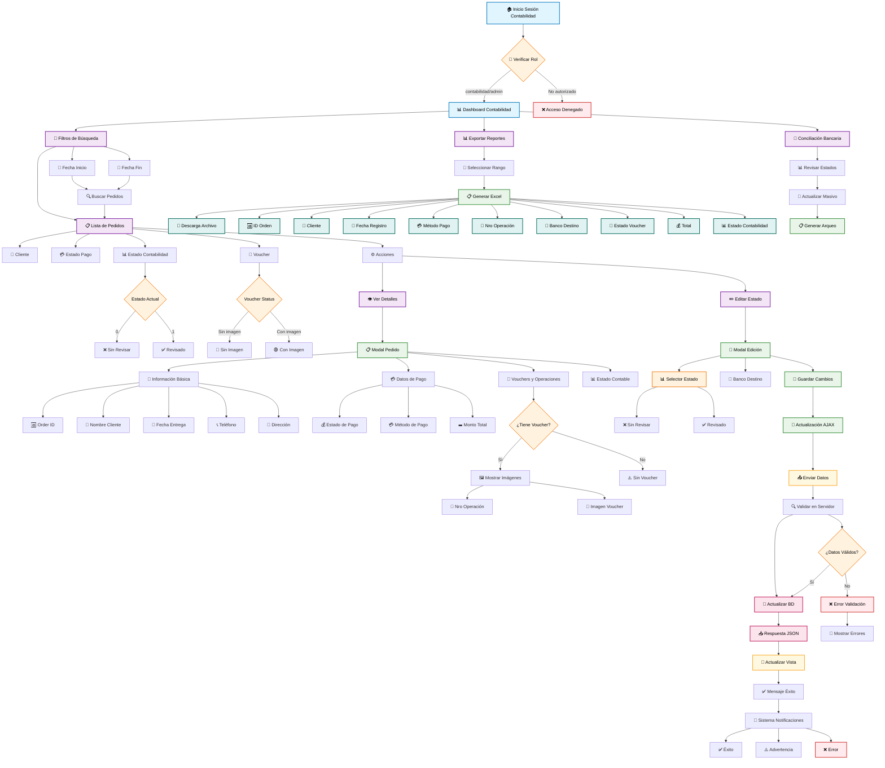

# 💰 Módulo Contabilidad - Workflow del Sistema

## 📊 Descripción General

El módulo de **Contabilidad** es el sistema de gestión financiera y revisión de pagos del sistema GROBDI. Se encarga de la verificación, conciliación y arqueo de todos los pedidos realizados, gestionando estados contables, bancos destino y generación de reportes financieros.

## 🔧 Componentes Técnicos

### Controlador Principal
- **PedidosContaController** - Gestión completa del módulo contabilidad

### Modelos Utilizados
- **Pedidos** - Entidad principal con campos contables
- **Exports/PedidoscontabilidadExport** - Exportación de reportes Excel

### Rutas y Middleware
```php
Route::resource('pedidoscontabilidad', PedidosContaController::class)
    ->middleware(['checkRole:contabilidad,admin']);
Route::get('/pedidoscontabilidad/downloadExcel/{fechainicio}/{fechafin}', 
    PedidosContaController::class .'@downloadExcel')
    ->name('pedidoscontabilidad.downloadExcel')
    ->middleware(['checkRole:contabilidad,admin']);
```

### Vista Principal
- **resources/views/pedidos/contabilidad/index.blade.php** - Dashboard principal

## 🎯 Roles y Permisos

| Rol | Permisos |
|-----|----------|
| `contabilidad` | ✅ Acceso completo al módulo |
| `admin` | ✅ Acceso completo al módulo |

---

## 🔄 Diagrama de Flujo del Módulo Contabilidad



---

## 📋 Funcionalidades Principales

### 1. 🔍 **Filtrado y Búsqueda**
- **Filtros por rango de fechas** para búsquedas específicas
- **Validación de fechas** con fecha fin posterior a fecha inicio
- **Búsqueda automática** por período seleccionado

### 2. 📊 **Gestión de Estados Contables**
- **Estado Sin Revisar (0)** - Pedidos pendientes de verificación
- **Estado Revisado (1)** - Pedidos verificados y validados
- **Actualización AJAX** en tiempo real sin recarga de página

### 3. 🏦 **Gestión Bancaria**
- **Banco Destino** configurable por pedido
- **Número de Operación** asociado a vouchers
- **Conciliación bancaria** automática

### 4. 🧾 **Gestión de Vouchers**
- **Visualización de vouchers** cargados
- **Estado de voucher** (Con imagen/Sin imagen)
- **Múltiples vouchers** por pedido con números de operación

### 5. 📊 **Reportes y Exportación**
- **Exportación Excel** con todos los datos contables
- **Arqueos por período** específico
- **Reportes personalizables** por rango de fechas

### 6. 🔄 **Actualización en Tiempo Real**
- **AJAX Integration** para actualizaciones sin recarga
- **Validación en tiempo real** de cambios
- **Notificaciones instantáneas** de éxito/error

---

## 🎛️ **Campos de la Base de Datos**

### Campos Contables en Modelo Pedidos:
```php
- accountingStatus: integer (0=Sin revisar, 1=Revisado)
- bancoDestino: string (Banco destino del pago)
- voucher: string (URLs de imágenes separadas por comas)
- operationNumber: string (Números de operación separados por comas)
- paymentStatus: string (Estado del pago)
- paymentMethod: string (Método de pago utilizado)
- prize: decimal (Monto total del pedido)
```

---

## 🔧 **Tecnologías Utilizadas**

- **Laravel Framework** - Backend y lógica de negocio
- **AJAX/jQuery** - Actualizaciones en tiempo real
- **Bootstrap** - Interfacing y componentes UI
- **Maatwebsite Excel** - Exportación de reportes
- **Carbon** - Manejo de fechas
- **Blade Templates** - Vistas y componentes

---

## 📈 **Métricas y KPIs**

- **Pedidos Revisados vs Pendientes**
- **Tiempo promedio de revisión contable**
- **Porcentaje de vouchers cargados**
- **Conciliación bancaria por período**
- **Arqueos diarios/mensuales**

---

## 🔒 **Seguridad y Validación**

- **Middleware de roles** (contabilidad, admin)
- **Validación CSRF** en formularios
- **Validación de fechas** en filtros
- **Sanitización de datos** en actualizaciones AJAX
- **Control de acceso** por rutas protegidas

---

## 📝 **Notas Técnicas**

- Las actualizaciones de estado se realizan via **AJAX** para mejor UX
- Los **vouchers múltiples** se manejan mediante arrays separados por comas
- La **exportación Excel** incluye formateo automático de fechas
- El sistema mantiene **trazabilidad completa** de cambios contables
