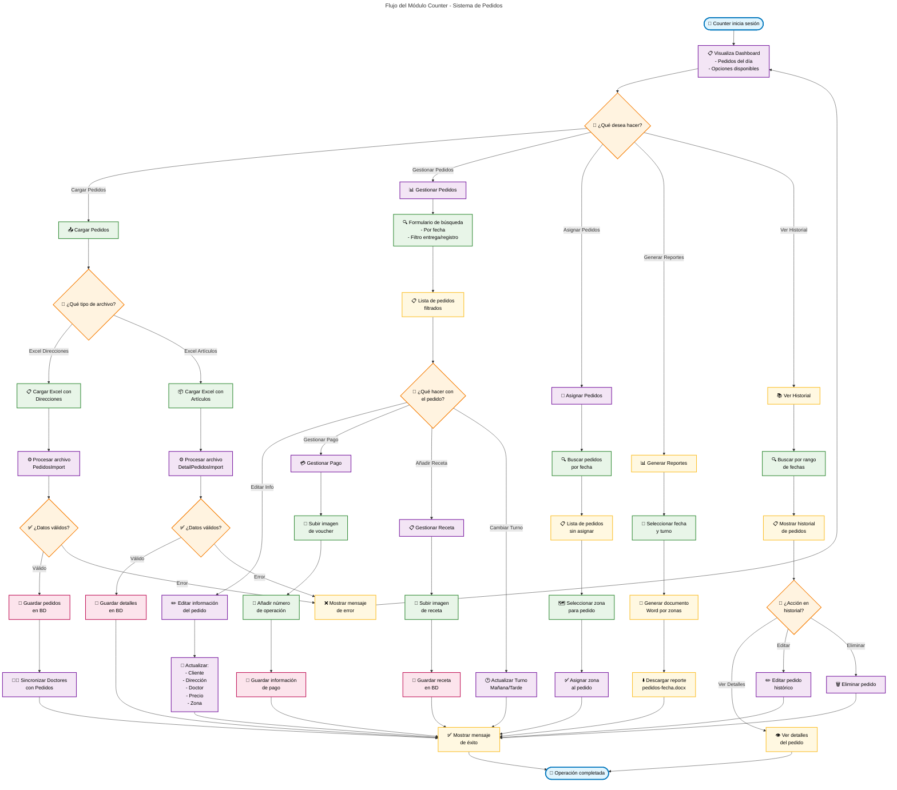

# Diagrama de Flujo - Módulo Counter 📊

## Descripción General

El módulo **Counter** es el encargado de gestionar la carga, procesamiento y asignación de pedidos en el sistema. Es el punto central donde se importan los datos de pedidos desde archivos Excel y se preparan para su distribución a otros módulos.

## Diagrama de Flujo

## Explicación Detallada del Flujo

### 🔐 Inicio del Proceso
1. **Login Counter**: El usuario con rol `counter` inicia sesión en el sistema
2. **Dashboard**: Visualiza el panel principal con las opciones disponibles

### 📤 Carga de Pedidos
El Counter puede cargar dos tipos de archivos Excel:

#### 📋 Excel con Direcciones
- **Archivo**: Contiene información básica de pedidos (cliente, dirección, doctor, etc.)
- **Procesamiento**: Utiliza `PedidosImport` para procesar el archivo
- **Validación**: Verifica que los datos sean correctos y completos
- **Almacenamiento**: Guarda los pedidos en la base de datos
- **Sincronización**: Automáticamente sincroniza con la base de datos de doctores

#### 📦 Excel con Artículos  
- **Archivo**: Contiene los detalles de productos/medicamentos de cada pedido
- **Procesamiento**: Utiliza `DetailPedidosImport` para procesar
- **Validación**: Verifica artículos y cantidades
- **Almacenamiento**: Guarda los detalles en la tabla `detail_pedidos`

### 📊 Gestión de Pedidos Existentes
Una vez cargados, el Counter puede:

#### 🔍 Búsqueda y Filtrado
- **Por fecha**: Fecha de entrega o fecha de registro
- **Filtros**: Diversos criterios de búsqueda
- **Resultados**: Lista paginada de pedidos

#### ✏️ Edición de Pedidos
- **Información básica**: Cliente, dirección, doctor, precio
- **Zona de entrega**: Asignación a zona específica
- **Fecha de entrega**: Reprogramación si es necesario

#### 💳 Gestión de Pagos
- **Vouchers**: Subida de imágenes de comprobantes
- **Números de operación**: Registro de transacciones
- **Múltiples pagos**: Soporte para varios vouchers por pedido

#### 📋 Gestión de Recetas
- **Imágenes**: Subida de fotos de recetas médicas
- **Almacenamiento**: Guardado seguro en el servidor

#### 🕐 Gestión de Turnos
- **Turnos**: Mañana (antes 15:00) o Tarde (después 15:00)
- **Cambios**: Actualización manual de turnos

### 🎯 Asignación de Zonas
- **Búsqueda**: Pedidos por fecha específica
- **Asignación**: Selección de zona de entrega para cada pedido
- **Automatización**: El sistema puede sugerir zonas basadas en distritos

### 📊 Generación de Reportes
- **Formato Word**: Documentos organizados por zona
- **Filtrado**: Por fecha y turno (mañana/tarde)
- **Contenido**: Lista completa de pedidos con detalles
- **Descarga**: Archivo `pedidos-fecha.docx`

### 📚 Historial de Pedidos
- **Consulta**: Búsqueda por rangos de fecha
- **Visualización**: Detalles completos de pedidos históricos
- **Edición**: Modificación de pedidos anteriores (según permisos)
- **Eliminación**: Borrado de pedidos (solo jefe de operaciones)

## Características Técnicas

### 🔒 Seguridad y Permisos
- **Roles autorizados**: `counter`, `admin`, `Administracion`
- **Middleware**: Verificación de roles en cada ruta
- **Validaciones**: Sanitización de datos de entrada

### 💾 Almacenamiento
- **Base de datos**: MySQL/MariaDB
- **Archivos**: Vouchers y recetas en carpetas organizadas
- **Respaldos**: Sistema de versionado de imágenes

### 🔄 Integración
- **Doctores**: Sincronización automática con base de datos médica
- **Zonas**: Asignación automática basada en distritos
- **Motorizados**: Preparación de datos para entrega

### ⚡ Optimizaciones
- **Carga masiva**: Procesamiento eficiente de archivos Excel
- **Paginación**: Manejo de grandes volúmenes de datos
- **Caché**: Optimización de consultas frecuentes

## Estados de Pedidos

### 📈 Flujo de Estados
1. **Nuevo**: Recién importado del Excel
2. **Procesado**: Información completada y validada
3. **Asignado**: Zona de entrega definida
4. **En Producción**: Enviado a laboratorio
5. **Listo**: Preparado para entrega
6. **En Ruta**: Asignado a motorizado
7. **Entregado**: Completado exitosamente

### 🔄 Transiciones Permitidas
- Counter puede mover pedidos entre estados: Nuevo → Procesado → Asignado
- Cambios posteriores requieren coordinación con otros módulos

## Reportes y Analytics

### 📊 Métricas Importantes
- **Volumen diario**: Cantidad de pedidos procesados
- **Distribución por zonas**: Análisis geográfico
- **Tiempos de procesamiento**: Eficiencia operativa
- **Errores de importación**: Control de calidad

### 📈 Indicadores de Rendimiento
- **Tiempo promedio de carga**: Medición de eficiencia
- **Tasa de errores**: Calidad de datos importados
- **Pedidos por hora**: Capacidad de procesamiento

---

*Este diagrama representa el flujo completo del módulo Counter, desde la carga inicial de datos hasta la preparación final para otros módulos del sistema.*
