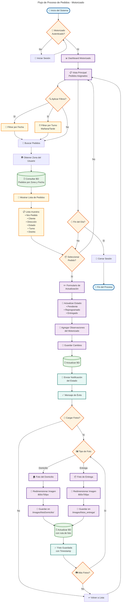

```mermaid
---
title: Flujo de Proceso de Pedidos - Motorizado
---
flowchart TD
    %% Inicio del flujo
    START([🚀 Inicio del Sistema]) --> LOGIN{👤 Motorizado<br>Autenticado?}
    
    %% Autenticación
    LOGIN -->|No| AUTH[🔐 Iniciar Sesión]
    AUTH --> LOGIN
    LOGIN -->|Sí| DASHBOARD[📊 Dashboard Motorizado]
    
    %% Dashboard principal
    DASHBOARD --> INDEX[📋 Vista Principal<br>Pedidos Asignados]
    
    %% Filtros de búsqueda
    INDEX --> FILTERS{🔍 Aplicar Filtros?}
    FILTERS -->|Sí| DATE_FILTER[📅 Filtrar por Fecha]
    FILTERS -->|Sí| TURNO_FILTER[⏰ Filtrar por Turno<br>Mañana/Tarde]
    DATE_FILTER --> SEARCH[🔎 Buscar Pedidos]
    TURNO_FILTER --> SEARCH
    FILTERS -->|No| SEARCH
    
    %% Obtener pedidos de la zona
    SEARCH --> GET_ZONE[🌍 Obtener Zona del Usuario]
    GET_ZONE --> QUERY_DB[(🗄️ Consultar BD<br>Pedidos por Zona y Fecha)]
    QUERY_DB --> DISPLAY_LIST[📃 Mostrar Lista de Pedidos]
    
    %% Estados de pedidos mostrados
    DISPLAY_LIST --> LIST_INFO[📋 Lista muestra:<br>• Nro Pedido<br>• Cliente<br>• Dirección<br>• Estado<br>• Turno<br>• Distrito]
    
    %% Selección de pedido
    LIST_INFO --> SELECT_ORDER{📦 Seleccionar<br>Pedido?}
    SELECT_ORDER -->|No| INDEX
    SELECT_ORDER -->|Sí| EDIT_FORM[✏️ Formulario de<br>Actualización]
    
    %% Formulario de edición
    EDIT_FORM --> UPDATE_STATUS[📝 Actualizar Estado:<br>• Pendiente<br>• Reprogramado<br>• Entregado]
    UPDATE_STATUS --> ADD_DETAILS[📝 Agregar Observaciones<br>del Motorizado]
    ADD_DETAILS --> SAVE_CHANGES[💾 Guardar Cambios]
    
    %% Guardado y notificación
    SAVE_CHANGES --> UPDATE_DB[(🗄️ Actualizar BD)]
    UPDATE_DB --> NOTIFICATION[📢 Enviar Notificación<br>del Estado]
    NOTIFICATION --> SUCCESS_MSG[✅ Mensaje de Éxito]
    
    %% Proceso de fotos
    SUCCESS_MSG --> PHOTOS{📸 Cargar Fotos?}
    PHOTOS -->|No| RETURN_LIST[↩️ Volver a Lista]
    PHOTOS -->|Sí| PHOTO_TYPE{🖼️ Tipo de Foto}
    
    %% Tipos de fotos
    PHOTO_TYPE -->|Domicilio| HOUSE_PHOTO[🏠 Foto del Domicilio]
    PHOTO_TYPE -->|Entrega| DELIVERY_PHOTO[📦 Foto de Entrega]
    
    %% Procesamiento de fotos
    HOUSE_PHOTO --> RESIZE_HOUSE[📐 Redimensionar Imagen<br>800x700px]
    DELIVERY_PHOTO --> RESIZE_DELIVERY[📐 Redimensionar Imagen<br>800x700px]
    
    RESIZE_HOUSE --> SAVE_HOUSE[💾 Guardar en<br>/images/fotoDomicilio/]
    RESIZE_DELIVERY --> SAVE_DELIVERY[💾 Guardar en<br>/images/fotos_entrega/]
    
    SAVE_HOUSE --> UPDATE_PHOTO_DB[(🗄️ Actualizar BD<br>con ruta de foto)]
    SAVE_DELIVERY --> UPDATE_PHOTO_DB
    
    UPDATE_PHOTO_DB --> PHOTO_SUCCESS[✅ Foto Guardada<br>con Timestamp]
    PHOTO_SUCCESS --> MORE_PHOTOS{📷 Más Fotos?}
    
    MORE_PHOTOS -->|Sí| PHOTO_TYPE
    MORE_PHOTOS -->|No| RETURN_LIST
    
    %% Vuelta al inicio
    RETURN_LIST --> INDEX
    
    %% Fin del proceso
    INDEX --> END_DAY{🌅 Fin del Día?}
    END_DAY -->|No| SELECT_ORDER
    END_DAY -->|Sí| LOGOUT[👋 Cerrar Sesión]
    LOGOUT --> END([🏁 Fin del Proceso])
    
    %% Estilos para diferentes tipos de nodos
    classDef startEnd fill:#e1f5fe,stroke:#01579b,stroke-width:3px
    classDef process fill:#f3e5f5,stroke:#4a148c,stroke-width:2px
    classDef decision fill:#fff3e0,stroke:#e65100,stroke-width:2px
    classDef database fill:#e8f5e8,stroke:#2e7d32,stroke-width:2px
    classDef success fill:#e8f8f5,stroke:#00695c,stroke-width:2px
    classDef photo fill:#fff8e1,stroke:#f57c00,stroke-width:2px
    
    %% Aplicar estilos
    class START,END startEnd
    class DASHBOARD,INDEX,EDIT_FORM,UPDATE_STATUS,ADD_DETAILS,SAVE_CHANGES,HOUSE_PHOTO,DELIVERY_PHOTO,RESIZE_HOUSE,RESIZE_DELIVERY,SAVE_HOUSE,SAVE_DELIVERY process
    class LOGIN,FILTERS,SELECT_ORDER,PHOTOS,PHOTO_TYPE,MORE_PHOTOS,END_DAY decision
    class QUERY_DB,UPDATE_DB,UPDATE_PHOTO_DB database
    class SUCCESS_MSG,NOTIFICATION,PHOTO_SUCCESS success
    class DATE_FILTER,TURNO_FILTER,DISPLAY_LIST,LIST_INFO photo
```
