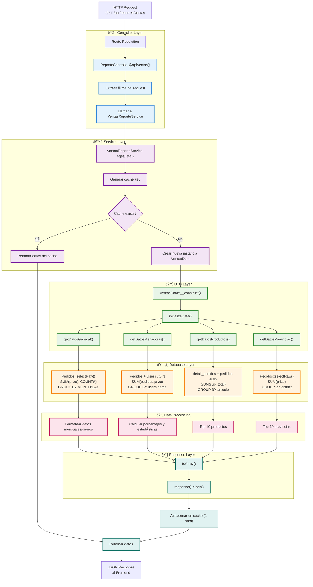

```mermaid
flowchart TD
    %% Punto de entrada
    A[HTTP Request<br/>GET /api/reportes/ventas] --> B[Route Resolution]

    %% Capa de Controller
    subgraph "🎯 Controller Layer"
        B --> C["ReporteController@apiVentas()"]
        C --> D["Extraer filtros del request"]
        D --> E["Llamar a VentasReporteService"]
    end

    %% Capa de Service
    subgraph "âš™ï¸ Service Layer"
        E --> F["VentasReporteService->getData()"]
        F --> G["Generar cache key"]
        G --> H{Cache exists?}
        H -->|Sí| I["Retornar datos del cache"]
        H -->|No| J["Crear nueva instancia VentasData"]
    end

    %% Capa de DTO
    subgraph "📊 DTO Layer"
        J --> K["VentasData::__construct()"]
        K --> L["initializeData()"]
        L --> M["getDatosGeneral()"]
        L --> N["getDatosVisitadoras()"]
        L --> O["getDatosProductos()"]
        L --> P["getDatosProvincias()"]
    end

    %% Consultas a Base de Datos
    subgraph "ðŸ—„ï¸ Database Layer"
        M --> Q["Pedidos::selectRaw()<br/>SUM(prize), COUNT(*)<br/>GROUP BY MONTH/DAY"]
        N --> R["Pedidos + Users JOIN<br/>SUM(pedidos.prize)<br/>GROUP BY users.name"]
        O --> S["detail_pedidos + pedidos JOIN<br/>SUM(sub_total)<br/>GROUP BY articulo"]
        P --> T["Pedidos::selectRaw()<br/>SUM(prize)<br/>GROUP BY district"]
    end

    %% Procesamiento de Resultados
    subgraph "🔄 Data Processing"
        Q --> U["Formatear datos mensuales/diarios"]
        R --> V["Calcular porcentajes y estadísticas"]
        S --> W["Top 10 productos"]
        T --> X["Top 10 provincias"]
    end

    %% Conversión y Respuesta
    subgraph "📦 Response Layer"
        U --> Y["toArray()"]
        V --> Y
        W --> Y
        X --> Y
        Y --> Z["response()->json()"]
    end

    %% Cache y Respuesta Final
    I --> AA["Retornar datos"]
    Z --> BB["Almacenar en cache (1 hora)"]
    BB --> AA

    %% Respuesta HTTP
    AA --> CC["JSON Response<br/>al Frontend"]

    %% Estilos para las capas
    classDef controller fill:#e3f2fd,stroke:#1976d2,stroke-width:2px
    classDef service fill:#f3e5f5,stroke:#7b1fa2,stroke-width:2px
    classDef dto fill:#e8f5e8,stroke:#388e3c,stroke-width:2px
    classDef database fill:#fff3e0,stroke:#f57c00,stroke-width:2px
    classDef processing fill:#fce4ec,stroke:#c2185b,stroke-width:2px
    classDef response fill:#e0f2f1,stroke:#00695c,stroke-width:2px

    class C,D,E controller
    class F,G,H,I,J service
    class K,L,M,N,O,P dto
    class Q,R,S,T database
    class U,V,W,X processing
    class Y,Z,AA,BB response
```